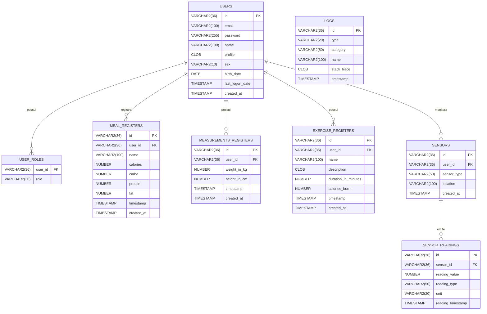

# Persistência Oracle – Mindfit

## Visão geral
Este diretório reúne toda a estrutura necessária para operar o projeto Mindfit com Oracle, atendendo às etapas solicitadas para a disciplina Smart HAS:

- Modelo lógico/físico consolidado no Oracle.
- Scripts de criação de tabelas, seed de dados simulados (usuários, sensores e registros históricos).
- Funções e procedimentos PL/SQL adicionando inteligência diretamente ao banco.
- Integração do backend Java via JDBC/Stored Procedure.

## DER (modelo relacional)


## Scripts disponíveis

| Script | Local | Descrição |
| --- | --- | --- |
| `schema.sql` | `mindfit-api/src/main/resources/db/oracle/` | Cria todas as tabelas, índices e chaves estrangeiras (inclui sensores). |
| `seed-data.sql` | `mindfit-api/src/main/resources/db/oracle/` | Popular dados simulados de usuário, medições, refeições, exercícios, sensores e logs. |
| `functions.sql` | `mindfit-api/src/main/resources/db/oracle/plsql/` | Funções `fn_calculate_bmi` e `fn_format_user_profile`. |
| `procedures.sql` | `mindfit-api/src/main/resources/db/oracle/plsql/` | Procedures `sp_generate_user_consumption_report` e `sp_register_sensor_alert`. |

### Como executar os scripts no VS Code
1. Conecte-se ao banco Mindfit pela extensão Oracle Database.
2. Execute `schema.sql` para recriar a estrutura.
3. Rode `seed-data.sql` para inserir os dados iniciais.
4. Execute `functions.sql` e `procedures.sql` para criar os objetos PL/SQL.

## Funções PL/SQL entregues
- **`fn_calculate_bmi(p_user_id)`**: retorna o IMC (Body Mass Index) estimado usando a última medição de peso/altura. Inclui tratamento de exceções.
- **`fn_format_user_profile(p_user_id)`**: devolve um texto formatado com status do usuário (nome, último login, peso, altura e IMC). Faz uso da função anterior e trata cenários sem dados.

### Exemplos de uso
```sql
SELECT fn_calculate_bmi('11111111-1111-1111-1111-111111111111') AS bmi FROM dual;
SELECT fn_format_user_profile('11111111-1111-1111-1111-111111111111') AS resumo FROM dual;
```

## Procedures PL/SQL entregues
- **`sp_generate_user_consumption_report`**: devolve (via parâmetros OUT) totais de calorias ingeridas, queimadas e diferença líquida. Foi integrada ao backend via `SimpleJdbcCall`.
- **`sp_register_sensor_alert`**: registra uma nova leitura de sensor e insere um alerta em `logs` caso o valor ultrapasse o limite informado.

### Exemplos de uso
```sql
DECLARE
  v_total NUMBER;
  v_burned NUMBER;
  v_net NUMBER;
BEGIN
  sp_generate_user_consumption_report('11111111-1111-1111-1111-111111111111', v_total, v_burned, v_net);
  DBMS_OUTPUT.PUT_LINE('Calorias: ' || v_total || ' | Gastas: ' || v_burned || ' | Líquido: ' || v_net);
END;
/

BEGIN
  sp_register_sensor_alert(
    p_sensor_id     => '66666666-6666-6666-6666-666666666666',
    p_reading_value => 135,
    p_unit          => 'BPM',
    p_reading_type  => 'HEART_RATE',
    p_threshold     => 120,
    p_description   => 'Frequência cardíaca acima do esperado durante exercício.'
  );
END;
/
```

## Integração com o backend Java
- Dependências migradas para `spring-boot-starter-data-jpa` e driver `ojdbc11`.
- `application.yml` configurado com `spring.datasource.*` e dialeto Oracle.
- Entidades (`User`, `MealRegister`, `MeasurementsRegister`, `ExerciseRegister`, `Log`) convertidas para JPA.
- Repositórios agora herdam `JpaRepository`.
- Novo serviço `ReportService` executa `sp_generate_user_consumption_report` via `SimpleJdbcCall`.
- Endpoint `GET /users/{id}/consumption-report` retorna `UserConsumptionReportResponse` com os dados do procedimento.

## Dados simulados
O seed inclui:
- Usuário Alice (com hash BCrypt), papéis, refeições, exercícios e medições.
- Sensor cardíaco com leitura crítica para disparar alertas.
- Registro inicial na tabela de logs.

## Próximos passos sugeridos
- Utilizar `sp_register_sensor_alert` a partir de um endpoint para fechar o ciclo completo.
- Expandir as funções PL/SQL com cálculos adicionais (por exemplo, metas semanais).
- Automatizar a execução dos scripts via pipeline ou liquibase/flyway, conforme governança do time.
